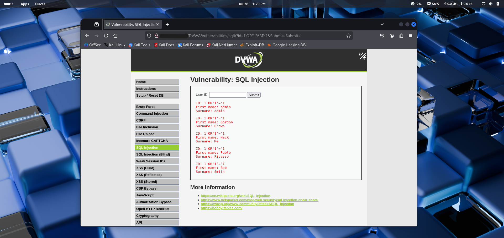
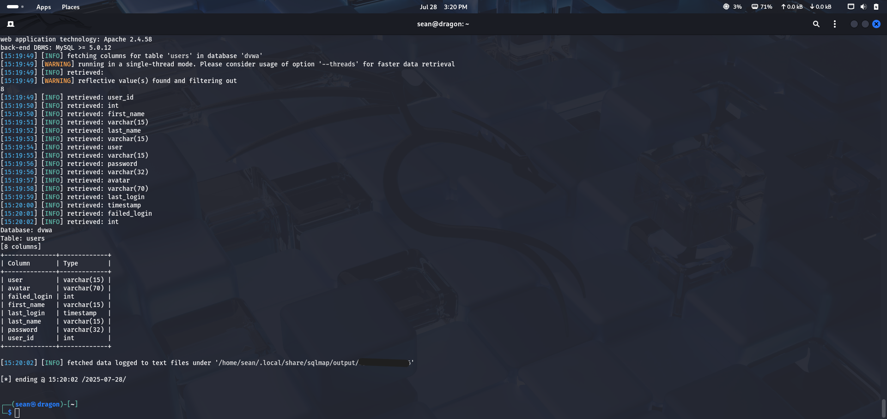

# SQL Injection Detection & Patching Lab

This project simulates a real-world web application attack and defense lifecycle using DVWA (Damn Vulnerable Web Application). It covers:

- SQL injection detection (manual and automated)
- Exploitation with sqlmap
- Patching using secure code practices
- Troubleshooting real-world issues like session cookies, redirects, and injection detection

---

## Lab Setup

| Role      | System        | Tools                     |
|-----------|---------------|---------------------------|
| Attacker  | Kali Linux VM | sqlmap, curl, Firefox     |
| Target    | Ubuntu VM     | Apache2, MySQL, DVWA      |

---

## Screenshots

| Stage | Preview |
|-------|---------|
| Manual SQL Injection |  |
| sqlmap Data Dump | ) |

---

## Outcome

- SQLi confirmed via browser and sqlmap
- Usernames and hashes dumped
- Vulnerability patched using DVWA’s high-security setting
- sqlmap re-test failed — patch validated

---

## Key Learnings

- Web app security and offensive testing
- Session/cookie management for authenticated attacks
- SQLi mitigation via prepared statements
- Automation with `sqlmap`
- Patch verification techniques

---

## Related Blog Post

[SQL Injection Project Summary on My GitHub Blog](https://JohnSeanson.github.io/sql-injection-project/)

---
